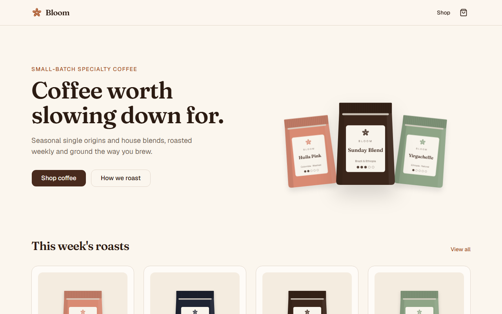
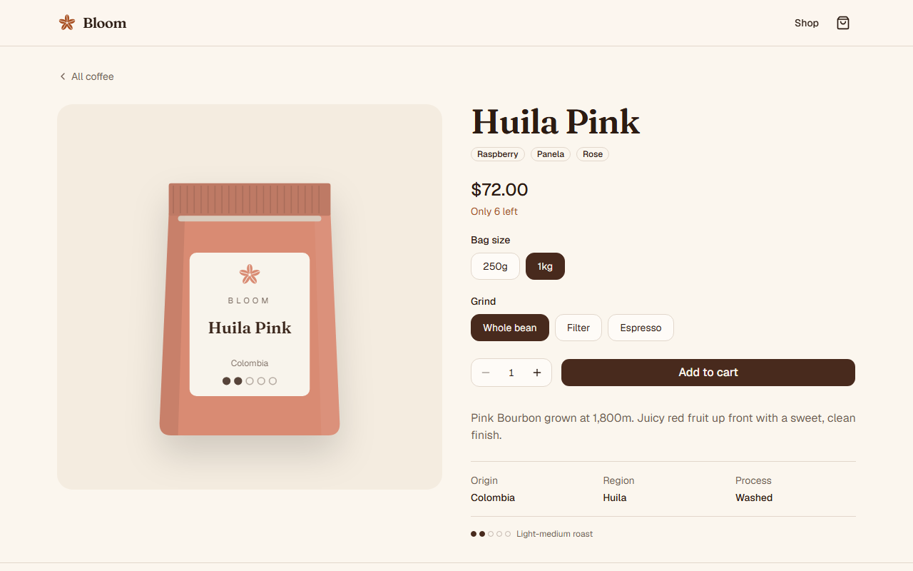
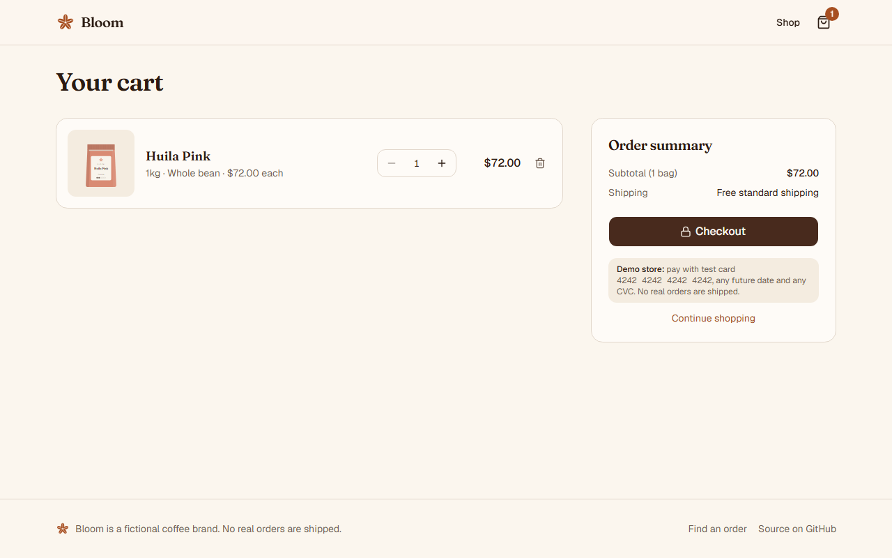
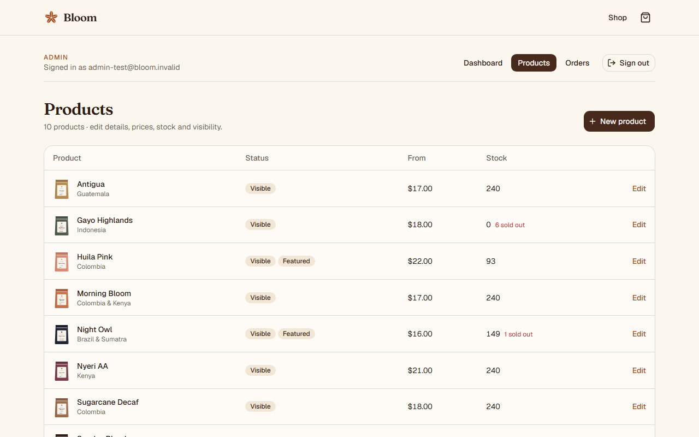
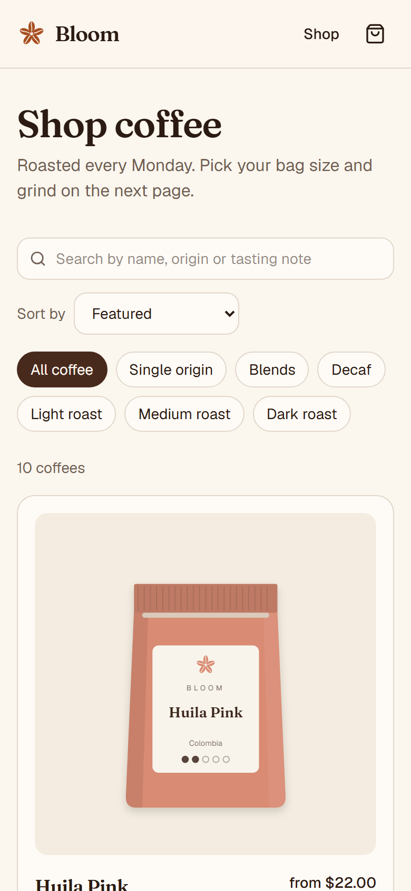
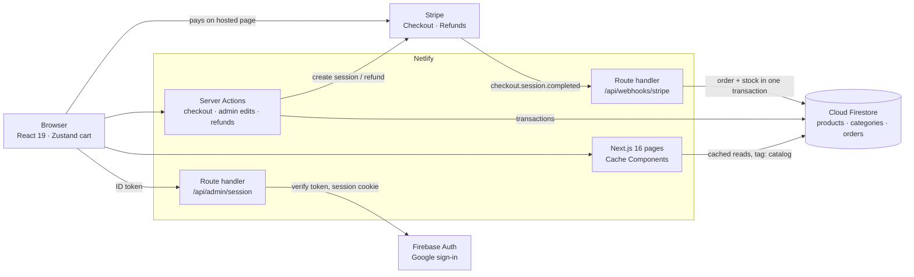

# Bloom

A full-stack coffee shop for a fictional specialty roaster. Customers browse seasonal roasts, choose a bag size and grind, and pay with Stripe. Admins sign in with Google to manage products, stock and orders, including refunds.

**Live demo:** https://bloomcoffee-shop.netlify.app · pay with Stripe's test card `4242 4242 4242 4242`, any future date and any CVC. No real orders are shipped.



## Features

**Shop**

- Catalog with categories, roast filters, accent-insensitive search and sorting, all kept in the URL so views can be shared
- Six variants per coffee (250g / 1kg × whole bean / filter / espresso), each with its own price and stock, including low-stock and sold-out states
- Cart persisted in the browser, with quantity limits based on live stock
- Stripe Checkout with shipping rates; the server re-prices every line from Firestore, so a tampered cart is corrected before any payment
- Order confirmation with a reference, plus an order lookup page (reference + email)

**Admin** (Google sign-in, email allowlist)

- Dashboard with order count, revenue, recent orders and low-stock variants
- Create and edit products: details, visibility, featured, and price and stock per variant
- Orders list with status filters and search; mark as shipped, or cancel with a full **Stripe refund** that returns the stock

| Product page                                                      | Cart                                                  |
| ----------------------------------------------------------------- | ----------------------------------------------------- |
|  |  |

| Admin products                                             | Mobile                                                                         |
| ---------------------------------------------------------- | ------------------------------------------------------------------------------ |
|  |  |

## Architecture



- **Firestore is only reached from server code** (Admin SDK). Security rules deny all browser access, and the service account can't reach a client bundle (`server-only`).
- **Catalog reads are cached** with `use cache` and the `catalog` tag. Admin edits call `updateTag` so changes show on the next request; paid orders call `revalidateTag` so stock refreshes.
- **Checkout** sends only slugs, variant ids and quantities. The server re-prices from Firestore and returns corrections instead of creating a session when prices or stock changed.
- **The webhook** verifies Stripe's signature and writes the order and stock decrement in one transaction. It's idempotent, because Stripe retries deliveries.
- **Admin auth**: a Google ID token is exchanged for an httpOnly Firebase session cookie. Every admin page, query and Server Action re-verifies it and re-checks the allowlist.

## Engineering decisions worth a look

| Problem                                                     | Approach                                                                                                                                           |
| ----------------------------------------------------------- | -------------------------------------------------------------------------------------------------------------------------------------------------- |
| A customer edits cart prices in dev tools                   | Prices are never trusted from the browser; the server re-prices and reports changes ([`pricing.ts`](src/lib/checkout/pricing.ts))                  |
| Stripe delivers the same webhook twice                      | The order id is the Checkout Session id, checked inside the transaction ([`fulfill.ts`](src/lib/orders/fulfill.ts))                                |
| Stock runs out between checkout and payment                 | The paid item is kept and flagged `oversold`; stock never goes negative and `stockTaken` records what was removed                                  |
| An admin saves a stale stock number while an order comes in | The form carries the stock it loaded; the save is refused in a transaction if it changed ([`product-form.ts`](src/lib/admin/product-form.ts))      |
| A cancel is retried after the refund succeeded              | Refunds use a per-order idempotency key, so a retry returns the same refund ([`orders/actions.ts`](<src/app/admin/(protected)/orders/actions.ts>)) |
| Two admins create the same product URL                      | The existence check and create run in one transaction                                                                                              |

## Testing and CI

GitHub Actions runs on every pull request:

- **Checks:** ESLint, TypeScript, Prettier, **55 unit tests** (Vitest), and a guard that loads the server SDKs the way Netlify's functions do
- **End-to-end:** **Playwright** against a production build using the **Firebase Firestore and Auth emulators** (a `demo-` project that can't reach real Firebase), seeded fresh on every run:
  - shopping, filters, cart and checkout, including the real redirect to Stripe in test mode
  - admin sign-in, product create and edit (with the stock-conflict case), and orders, including a real Stripe test-mode refund
  - **axe-core accessibility scans** of the shop and admin pages; serious or critical WCAG 2.2 AA violations fail the build

## Tech stack

Next.js 16 (App Router, Server Actions, Cache Components) · React 19 · TypeScript · Tailwind CSS v4 · shadcn/ui · Cloud Firestore · Firebase Auth · Stripe · Zod · Zustand · Vitest · Playwright · axe-core · GitHub Actions · Netlify

## Getting started

Requires Node 24. Running the e2e suite locally also needs Java 21 for the Firebase emulators.

```bash
npm install
cp .env.example .env.local   # fill in Firebase and Stripe test keys
npm run db:seed              # load sample categories and coffees
npm run dev
```

To receive Stripe webhooks locally, run `stripe listen --forward-to localhost:3000/api/webhooks/stripe` and put the printed `whsec_` secret in `.env.local` as `STRIPE_WEBHOOK_SECRET`.

### Environment variables

| Variable                                                                                                                             | Used for                                              |
| ------------------------------------------------------------------------------------------------------------------------------------ | ----------------------------------------------------- |
| `FIREBASE_PROJECT_ID`, `FIREBASE_CLIENT_EMAIL`, `FIREBASE_PRIVATE_KEY`                                                               | Firebase Admin SDK (service account)                  |
| `NEXT_PUBLIC_FIREBASE_API_KEY`, `NEXT_PUBLIC_FIREBASE_AUTH_DOMAIN`, `NEXT_PUBLIC_FIREBASE_PROJECT_ID`, `NEXT_PUBLIC_FIREBASE_APP_ID` | Google sign-in in the browser (public values)         |
| `ADMIN_EMAILS`                                                                                                                       | Comma-separated Google accounts allowed into `/admin` |
| `STRIPE_SECRET_KEY`                                                                                                                  | Checkout sessions and refunds                         |
| `STRIPE_WEBHOOK_SECRET`                                                                                                              | Verifying webhook signatures                          |

## Scripts

| Command                     | Description                                                                            |
| --------------------------- | -------------------------------------------------------------------------------------- |
| `npm run dev`               | Start the dev server                                                                   |
| `npm run build`             | Production build                                                                       |
| `npm run lint`              | ESLint                                                                                 |
| `npm run typecheck`         | Generate route types and run `tsc`                                                     |
| `npm run format`            | Format with Prettier                                                                   |
| `npm test`                  | Unit tests (Vitest)                                                                    |
| `npm run e2e`               | Start the Firestore and Auth emulators, seed, build and run Playwright (needs Java 21) |
| `npm run check:server-deps` | Load server SDKs with `require(esm)` disabled, as on Netlify functions                 |
| `npm run db:seed`           | Seed Firestore with the sample catalog                                                 |

## Deployment notes

### Why `jose` is pinned for `jwks-rsa`

`package.json` contains `"overrides": { "jwks-rsa": { "jose": "^5.10.0" } }`.

`firebase-admin/auth` depends on `jwks-rsa@4`, which calls `require("jose")`, and `jose@6` is ESM-only, so loading it needs Node's `require(esm)` support. Netlify functions run on AWS Lambda's `nodejs24.x` runtime (Node 24.19 at the time of writing), whose launcher starts Node with `--no-experimental-require-module`. Without the override, every function that imported Firebase Auth crashed on start. `jose@5` ships a CommonJS build and has the same API for the four functions `jwks-rsa` uses (`importJWK`, `exportSPKI`, `decodeJwt`, `decodeProtectedHeader`).

- `npm run check:server-deps` loads the server SDKs with `require(esm)` disabled and fails if this regresses.
- The admin dashboard's **Server runtime** section shows what the live functions support.
- **Remove the override** once that section reports `require(esm)` as supported, then run `npm install` and `npm run check:server-deps` to confirm.

Firebase Auth is also only imported by the admin session code (`src/lib/firebase/auth.ts`), so checkout, the Stripe webhook and the catalog never depend on it.

### Netlify environment variables

- Mark real secrets as secret: `FIREBASE_PRIVATE_KEY`, `FIREBASE_CLIENT_EMAIL`, `STRIPE_SECRET_KEY`, `STRIPE_WEBHOOK_SECRET`.
- Don't mark public values as secret (`NEXT_PUBLIC_*`, `FIREBASE_PROJECT_ID`). They end up in the browser bundle, so Netlify's secret scan would fail the build.
- `SECRETS_SCAN_OMIT_PATHS` in `netlify.toml` skips Turbopack's build cache, which records env values but is never deployed.
